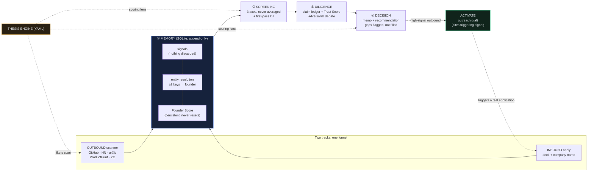
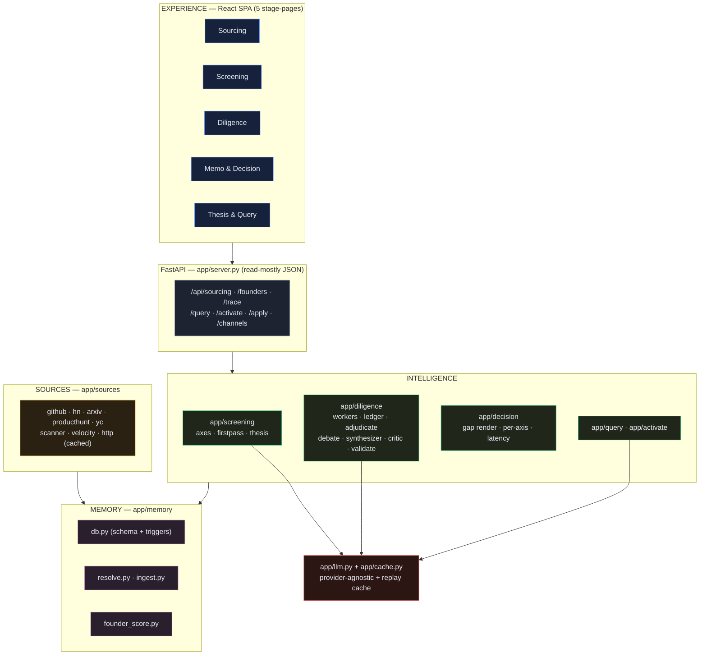
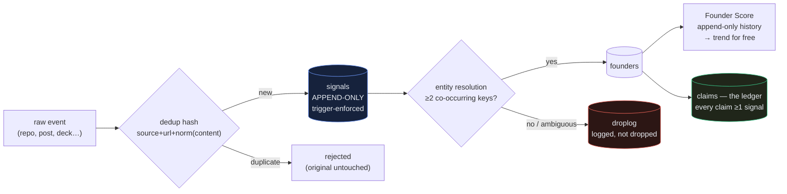
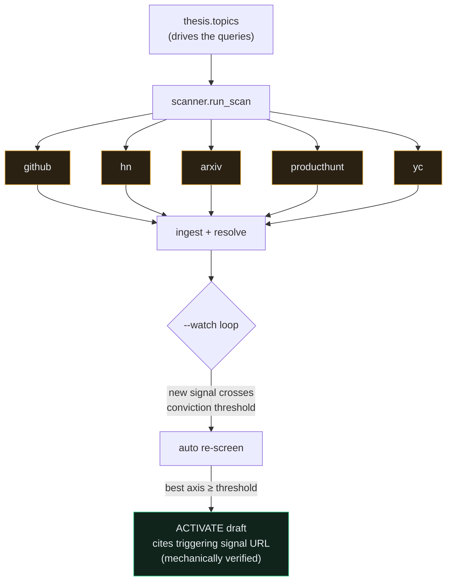
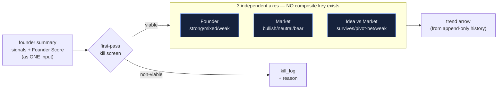
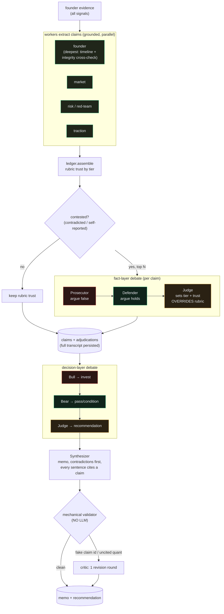
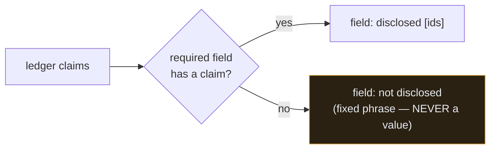
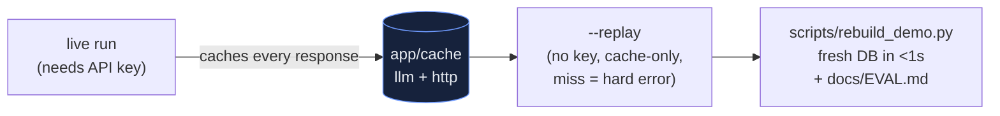

# VC Brain — Architecture

An evidence-first sourcing and diligence engine: it finds founders **before they
fundraise**, scores what is **verifiable** rather than who is connected, and produces a
**gap-honest $100K memo** in minutes. Everything traces back to a source; nothing in an
output path is fabricated.

Stack: Python + SQLite (single file, zero ops) · FastAPI · React/Vite SPA. Provider-agnostic
LLM wrapper (OpenAI or Anthropic) with a disk replay cache so the whole demo is deterministic.

---

## 1. The pipeline at a glance

The brief's four stages — Sourcing → Screening → Diligence → Decision — run on top of three
layers: **Memory** (data), **Intelligence** (reasoning), **Experience** (UI). Two intake tracks
(outbound scan + inbound apply) converge into one funnel.



The **thesis config** is applied twice — as a filter on the scanner and as a scoring lens in
screening/decision — so the same founder pool yields different answers for different funds.

---

## 2. Layers → stages → code



---

## 3. Memory — the data foundation

SQLite, ten tables. The design commitment is **"nothing discarded"**: the `signals` table is
append-only, *enforced by database triggers* (not convention), and signals that fail entity
resolution are logged rather than dropped.



**Tables:** `founders`, `signals`, `claims`, `resolutions`, `droplog`, `axis_scores`,
`adjudications`, `memos`, `latency`, `kill_log`, `outreach`.

**Founder Score** (persistent, per-person, never resets — distinct from the per-opportunity
3-axis score). Computed *mechanically* from evidence, so it is deterministic:

| Dimension | Source signal |
|---|---|
| execution_velocity | trailing-6-week commit cadence |
| community_pull | stars / HN points (log-scaled) |
| domain_breadth | number of distinct source channels |
| integrity | fraction of claims **not** contradicted |
| verified_depth | fraction of claims corroborated |

A dimension with no evidence is `None` (**unassessed**), never a fabricated zero — so a
cold-start founder gets a **low-coverage flag, not a low score**.

---

## 4. Sourcing — built deepest (the brief's priority)



Each adapter is ~40 lines: fetch → normalize to a Signal → ingest. Every live HTTP response is
cached by `(url, params)`; in replay mode a cache miss is a hard error — that's what makes the
demo deterministic. **Activate** drafts cold outreach and *rejects any draft that doesn't cite
the exact triggering signal* (no-fabrication guardrail applied to outreach too).

---

## 5. Screening — three axes, never averaged



Each axis is an independent LLM call against an anchored rubric; the result dict deliberately has
**no average/blended/overall field** (test-enforced). The disagreement between axes *is* the
signal an investor needs. The kill screen only removes obvious non-starters — never for thin
records, unverified claims, or off-sector fit (those are scoring matters).

---

## 6. Diligence — the claim ledger + adversarial Trust Score

This is where fragmented signals become verified, tiered claims. Contested claims go to trial.



**Trust tiers** (self-reported hard-capped at 0.6):

| Tier | Rubric trust | Meaning |
|---|---|---|
| corroborated | 0.85 | ≥2 independent sources agree |
| single_source | 0.60 | one external source |
| self_reported | 0.40 | deck/self only, no external backing |
| contradicted | 0.30 → judge lowers | external record conflicts with the claim |

A **negative-result search** ("EDGAR: no Form D found") is a first-class claim, with the search
URL as its source. The mechanical validator makes the pipeline *structurally* unable to
hallucinate a citation: any memo sentence or debate turn citing a claim id not in the ledger is
rejected.

---

## 7. Decision — and why gaps are a feature

The decision layer is pure assembly (no LLM, deterministic, zero cost): it pulls the stored
recommendation, renders the three axes **side by side**, and mechanically reports gaps.



The gap branch emits only the brief's own phrasing and is tested to contain **no digits** — a
placeholder value reaching a memo is treated as a P0 bug. Cap table missing → *"Cap table: not
disclosed"*, rendered as a deliberate badge, not an apology.

---

## 8. Agentic Traceability — the signature interaction

Every conclusion cites the exact data point that drove it. Clicking any citation in the UI walks
the full chain — this is the highest-leverage stretch goal, made visible.

```mermaid
flowchart LR
    C["memo sentence<br/>[team-01 · 0.10 · CONTRA]"]:::click --> CLM["Claim<br/>text · trust · tier"]
    CLM --> EVD["Evidence snippet"]
    EVD --> SG["Source signal<br/>dated, linked URL"]
    SG --> HOW["How trust was set"]
    HOW --> RUB["rubric anchor"]
    HOW --> TRIAL["OR: rubric value struck through<br/>+ prosecutor/defender/judge transcript"]
    classDef click fill:#16223c,stroke:#6f9bff,color:#e7ebf1
    style TRIAL fill:#2c1614,stroke:#f0655a,color:#e7ebf1
```

Every hop is data already in the DB (`claims.signal_ids` → `signals`; `adjudications` transcript)
— zero new reasoning, pure exposure.

---

## 9. Determinism & the demo



The logical LLM cache key is `(tier + prompt + schema)` — provider-independent — so a cache
seeded with one provider replays with **no key at all**. `python scripts/rebuild_demo.py`
rebuilds the entire demo database deterministically from committed caches and writes the eval
summary.

### Tavily ingestion

Open-web founder research (Tavily news search + extract, `app/sources/tavily.py`) is ingested
as **signals only**: untrusted web content never becomes a claim directly — claims derived from
it pass the same worker extraction, corroboration rubric, and adjudication as every other
source, and a lone article stays `single_source`. Tavily additionally applies prompt-injection
filtering on its side before content reaches us; we still treat article text as data, never as
instructions. All Tavily calls are replay-cached with a persisted per-month credit cap, and
news enrichment is refused for the three demo fixture founders so cached demo claims can never
be silently regenerated.

---

## 10. The three demo founders (the whole argument, in three rows)

| Founder | Track | Signal / Coverage | Decision | What it proves |
|---|---|---|---|---|
| **Tracewell** | outbound, cold-start | 8.4 / 46% | invest, conditional on incorporation | thin record ≠ weak; verified velocity is fundable |
| **Corevance** | inbound, credentialed | 4.6 / 92% | **pass** | rich record, but the two best claims fail verification — contradictions surfaced first |
| **Parcelmind** | inbound | 6.3 / 69% | invest, conditional on 1 reference call | one honest ambiguity, one named call resolves it |

Coverage and signal move **independently** — that is the equitable-allocation thesis of the whole
system, visible in one screen.

---

*Generated as a companion to `docs/vc-brain-spec.md` (design) and `docs/SUBMISSION.md` (rubric
write-up). Diagrams render on GitHub and any Mermaid-aware viewer.*
